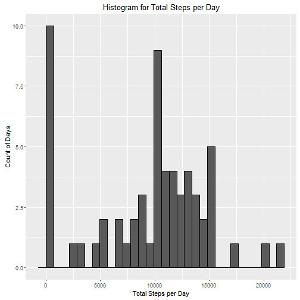
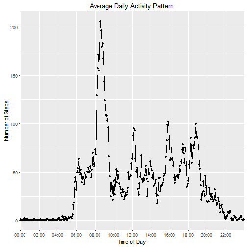
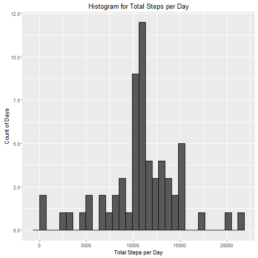
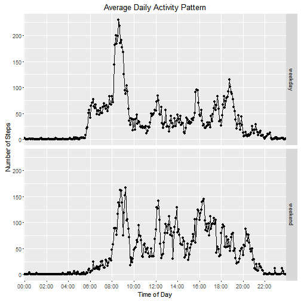

  
-----------------------------  
  
<!-- regular html comment --> 


## Introduction  

In this course assignment we are required to display our newly learnt skills in
*R Markdown* and reporting research in a consistent, well presented manner. The 
tasks in order to accomplish such goals are to collect, analyze and later 
display the resulting analysis graphs in a single R Markdown file. 

The data required for this analysis comes from an anonymous individual personal 
collected data through an activity monitoring device such as a Fitbit, Nike 
Fuelband, or Jawbone Up. Quoting the original assignment:

> These type of devices are part of the "quantified self" movement -- a group of 
enthusiasts who take measurements about themselves regularly to improve their 
health, to find patterns in their behavior, or because they are tech geeks 

The data has been sampled at 5 minute intervals through out the day. The data 
consists of the recorded activity through October and November, 2012 and include 
the number of steps taken in 5 minute intervals each day.

### Data

The data for this assignment can be downloaded from the course web
site, although the following analysis only requires it to be run from within the 
environment of the github repo:

* Dataset: [Activity monitoring data](https://d396qusza40orc.cloudfront.net/repdata%2Fdata%2Factivity.zip) [52K]

The variables included in this dataset are:

* **steps**: Number of steps taking in a 5-minute interval (missing
    values are coded as `NA`)

* **date**: The date on which the measurement was taken in YYYY-MM-DD
    format

* **interval**: Identifier for the 5-minute interval in which
    measurement was taken


The dataset is stored in a comma-separated-value (CSV) file and there
are a total of 17,568 observations in this
dataset.

### Requirements

* ggplot2, dplyr and lubridate packages.

### Output

* HTML document, and associated figures.


--------------------------------------------------------------------------------

## Analysis

### 0. Load Needed Packages


```r
library(ggplot2)
library(dplyr)
library(lubridate)
```

--------------------------------------------------------------------------------

### 1. Loading and Preprocessing the Data

Check the current directory to check whether the "repdata_data_activity.zip" file has been downloaded


```r
if(!file.exists("repdata_data_activity.zip")){
      
      file_url <- "https://d396qusza40orc.cloudfront.net/repdata%2Fdata%2Factivity.zip"
      
      download.file(file_url, destfile = "repdata_data_activity.zip")
      dateDownloaded <- date()
      
}
```

Then we will check wether the file is already unzipped


```r
if(!file.exists("activity.csv")){
      unzip("repdata_data_activity.zip")      
}
```

Now the the data is easily accesible, we will:

      1. Load the dataSet onto R
      2. Convert the date column to R-friendly dates
      3. Convert the interval column to HH:MM time format
      4. Convert the dataSet to a TBL for easier manipulation by dplyr


```r
activityData <- read.csv("activity.csv")
activityData$date <- as.Date(activityData$date , "%Y-%m-%d")

activityData$interval <- sprintf("%04d", activityData$interval)
activityData$interval <- strftime(strptime(activityData$interval, format="%H%M"), "%H:%M")

activityTBL <- tbl_df(activityData)

str(activityTBL)
```

```
## Classes 'tbl_df', 'tbl' and 'data.frame':	17568 obs. of  3 variables:
##  $ steps   : int  NA NA NA NA NA NA NA NA NA NA ...
##  $ date    : Date, format: "2012-10-01" "2012-10-01" ...
##  $ interval: chr  "00:00" "00:05" "00:10" "00:15" ...
```

```r
head(activityTBL)
```

```
## Source: local data frame [6 x 3]
## 
##   steps       date interval
##   (int)     (date)    (chr)
## 1    NA 2012-10-01    00:00
## 2    NA 2012-10-01    00:05
## 3    NA 2012-10-01    00:10
## 4    NA 2012-10-01    00:15
## 5    NA 2012-10-01    00:20
## 6    NA 2012-10-01    00:25
```

--------------------------------------------------------------------------------

### 2. What is Mean Total Number of Steps Taken Per Day?

In order to get the total number of steps per day, the activity table is grouped by date, and then summarised with the extra column totaling the total number of steps per day (dplyr).


```r
activityTBL.byDate   <- group_by(activityTBL, date)
activityTBL.sumSteps <- summarise(activityTBL.byDate,totalSteps = sum(steps, na.rm = TRUE))

head(activityTBL.sumSteps)
```

```
## Source: local data frame [6 x 2]
## 
##         date totalSteps
##       (date)      (int)
## 1 2012-10-01          0
## 2 2012-10-02        126
## 3 2012-10-03      11352
## 4 2012-10-04      12116
## 5 2012-10-05      13294
## 6 2012-10-06      15420
```

```r
qplot(activityTBL.sumSteps$totalSteps, 
      geom = "histogram",
      main = "Histogram for Total Steps per Day",
      xlab = "Total Steps per Day",
      ylab = "Count of Days",
      binwidth = range(activityTBL.sumSteps$totalSteps)[2]/30, 
      col=I("black"))
```

 

The mean number of steps per day is **9354.2295082** steps, 
and the median is **10395** steps.

--------------------------------------------------------------------------------

### 3. What is the Average Daily Activity Pattern?

A line plot of what the average day looks like will be represented. In order to do so, the steps for each interval will be averaged across all available days, and the interval will be represented by their time signature instead of their indices.


```r
activityTBL.byInterval <- group_by(activityTBL, interval)
activityTBL.avgSteps <- summarise(activityTBL.byInterval,avgSteps = mean(steps, na.rm = TRUE))

ggplot(activityTBL.avgSteps, aes(interval, avgSteps, group=1) ) +
    geom_line() + geom_point(colour="black") +
    scale_x_discrete(breaks = unique(activityTBL$interval)[seq(1,288, by=24)] ) +
    xlab("Time of Day") + ylab("Number of Steps") + ggtitle("Average Daily Activity Pattern")
```

 

The interval with the maximum average number of steps is the one occuring at  
**08:35**

--------------------------------------------------------------------------------

### 4. Imputing Missing Values

The total number of missing cases is **2304**


The strategy to replace the NAs will be as follows:

* A temporary dataset will be created, by joining the original data set and the 
grouped by interval and averaged across all days data set, by their respective 
interval label. Thanks to the replication function of R, every single interval 
will have next to it its corresponding across-all-days average values.

* Subsetting the indices of the NAs from the steps column and assining to them 
the corresponding across-all-days average values will solve our problem.


```r
activityTBL.replaceNA <- left_join(activityTBL, activityTBL.avgSteps, by = "interval")

activityData$steps[is.na(activityData$steps)]  <- activityTBL.replaceNA$avgSteps[is.na(activityData$steps)]

head(activityData)
```

```
##       steps       date interval
## 1 1.7169811 2012-10-01    00:00
## 2 0.3396226 2012-10-01    00:05
## 3 0.1320755 2012-10-01    00:10
## 4 0.1509434 2012-10-01    00:15
## 5 0.0754717 2012-10-01    00:20
## 6 2.0943396 2012-10-01    00:25
```

Repeating the analysis from #2


```r
activityTBL <- tbl_df(activityData)

activityTBL.byDate   <- group_by(activityTBL, date)
activityTBL.sumSteps <- summarise(activityTBL.byDate,totalSteps = sum(steps, na.rm = TRUE))

head(activityTBL.sumSteps)
```

```
## Source: local data frame [6 x 2]
## 
##         date totalSteps
##       (date)      (dbl)
## 1 2012-10-01   10766.19
## 2 2012-10-02     126.00
## 3 2012-10-03   11352.00
## 4 2012-10-04   12116.00
## 5 2012-10-05   13294.00
## 6 2012-10-06   15420.00
```

```r
qplot(activityTBL.sumSteps$totalSteps, 
      geom = "histogram",
      main = "Histogram for Total Steps per Day",
      xlab = "Total Steps per Day",
      ylab = "Count of Days",
      binwidth = range(activityTBL.sumSteps$totalSteps)[2]/30, 
      col=I("black"))
```

 

The mean number of steps per day is **1.0766189 &times; 10<sup>4</sup>** steps, 
and the median is **1.0766189 &times; 10<sup>4</sup>** steps.

Now both the median and the average coincide, and both have increased slightly 
w.r.t. their NA tolerant counterparts. The effect of estimating NAs has been the 
added data points, mostly for the low count of steps intervals which have 
overwhelmingly disappeared from the histogram.

--------------------------------------------------------------------------------

### 5. Are there differences in activity patterns between weekdays and weekends?

In order to filter the datatable between ***Weekdays*** and ***Weekends***, first we apply the weekdays() function to the date variable. Then, using the replace function we label those entries containng either Saturday or Sunday as "Weekend", followed by naming all those not named "weekend" to "weekdays".  


```r
activityTBL <- mutate(activityTBL, Weekday = weekdays(activityTBL$date))

activityTBL <- mutate(activityTBL, Weekday = replace(x = Weekday, list = (Weekday == "Sunday" | Weekday == "Saturday"), values = "weekend"))
activityTBL <- mutate(activityTBL, Weekday = replace(x = Weekday, list = (Weekday != "weekend"), values = "weekday"))

head(activityTBL)
```

```
## Source: local data frame [6 x 4]
## 
##       steps       date interval Weekday
##       (dbl)     (date)    (chr)   (chr)
## 1 1.7169811 2012-10-01    00:00 weekday
## 2 0.3396226 2012-10-01    00:05 weekday
## 3 0.1320755 2012-10-01    00:10 weekday
## 4 0.1509434 2012-10-01    00:15 weekday
## 5 0.0754717 2012-10-01    00:20 weekday
## 6 2.0943396 2012-10-01    00:25 weekday
```

```r
activityTBL.byInterval <- group_by(activityTBL, interval, Weekday)
activityTBL.avgSteps <- summarise(activityTBL.byInterval,avgSteps = mean(steps))

ggplot(activityTBL.avgSteps, aes(interval, avgSteps, group=1) ) +
    geom_line() + geom_point() +
    scale_x_discrete(breaks = unique(activityTBL$interval)[seq(1,288, by=24)] ) +
    xlab("Time of Day") + ylab("Number of Steps") + ggtitle("Average Daily Activity Pattern") +
    facet_grid(Weekday ~ .)
```

 


From the plot the following conclusions can be drawn:

* On weekends the subject starts his activities later in the day, at around 8am compared to 6am on weekdays

* The period from 10am to 4pm has a higher activity during weekends as compared to the same period during weekdays (perhaps suggesting an office job?)

* The subject slows down his/her activities earlier on weekdays (8pm) as compared to weekends (~9:30pm)

* The subject has his/her workouts/jog/exercise during weekdays, as the distinct peak at 8:30am suggests


--------------------------------------------------------------------------------
--------------------------------------------------------------------------------

Copyright (C) 2016 Tamanaco Francisquez

This program is free software: you can redistribute it and/or modify
it under the terms of the GNU General Public License as published by
the Free Software Foundation, either version 3 of the License, or
(at your option) any later version.

This program is distributed in the hope that it will be useful,
but WITHOUT ANY WARRANTY; without even the implied warranty of
MERCHANTABILITY or FITNESS FOR A PARTICULAR PURPOSE.  See the
GNU General Public License for more details.
